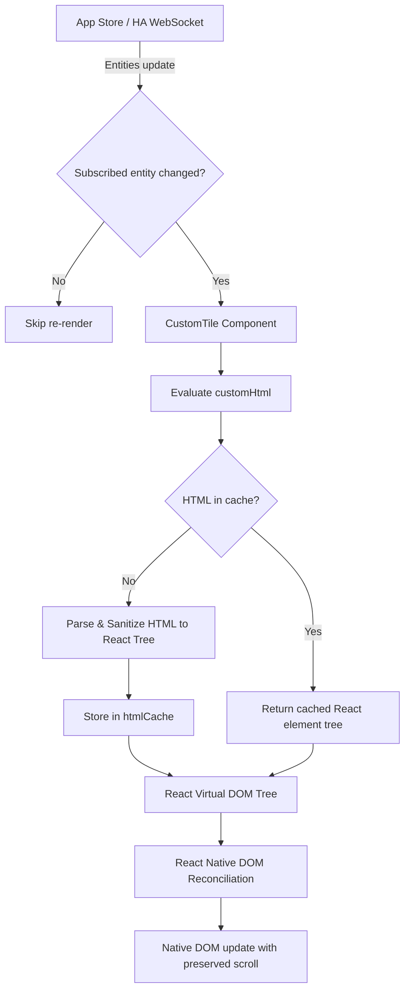

# Design Spec: CustomTile Safety and Performance Improvements

## Overview
This specification details the overhaul of `CustomTile` in TileBoard-React. The goals are:
1. **Safety**: Replace raw `dangerouslySetInnerHTML` with a safe, lightweight HTML-to-React Virtual DOM parser and sanitizer that converts HTML strings directly into native React elements.
2. **Resource Efficiency**: Prevent unnecessary re-renders of `CustomTile` by introducing targeted entity subscriptions, optional explicit entity dependency declarations (`entities: string[]`), parent re-render shields, and element caching.
3. **Preservation of UI State**: Because content is converted into genuine React Virtual DOM elements, React reconciles DOM nodes in-place rather than replacing container innerHTML, natively preserving scroll positions and interactive element state.

---

## 1. Safe HTML-to-React Virtual DOM Parser (`src/utils/htmlParser.ts`)

### 1.1 Architecture
The parser accepts an HTML string and converts it into a tree of React elements (`React.createElement`):
- Uses standard DOM parsing via browser `DOMParser` (`text/html`) or fallback element parser.
- Recursively traverses DOM nodes and constructs equivalent React elements with appropriate props (`className`, `style`, attributes, children).

### 1.2 Sanitization Rules
- **Blocked Tags**: `<script>`, `<iframe>`, `<object>`, `<embed>`, `<link>`, `<meta>`, `<applet>`, `<frame>`, `<frameset>`. These elements are completely stripped from the output tree.
- **Blocked Attributes**:
  - Any inline event handlers starting with `on` (e.g., `onclick`, `onerror`, `onload`, `onmouseover`).
  - Dangerous URL schemes in `href`, `src`, `action`, `formaction`, `xlink:href` (e.g., `javascript:`, `data:text/html`, `vbscript:`). Safe schemes (`http:`, `https:`, `mailto:`, relative URLs, `data:image/`) are allowed.
- **Allowed Content**:
  - Standard HTML elements: `div`, `span`, `i`, `p`, `table`, `thead`, `tbody`, `tr`, `td`, `th`, `ul`, `ol`, `li`, `img`, `svg`, `path`, `strong`, `em`, `b`, `a`, `h1`-`h6`, `br`, `hr`, etc.
  - Attributes: `class` (converted to `className`), `style` (parsed from CSS string to `React.CSSProperties` object), `id`, `title`, `alt`, `src`, `href`, `target`, `width`, `height`, data attributes (`data-*`), ARIA attributes (`aria-*`).

### 1.3 Element Caching
- A module-level LRU/Map cache (`htmlCache`) caches the parsed `React.ReactNode` tree by the input HTML string.
- If the exact same HTML string is evaluated in successive renders, parsing is bypassed and the cached React element tree is returned in $O(1)$ time.

---

## 2. Resource & Re-render Optimization

### 2.1 Explicit and Implicit Entity Dependencies
Tiles can specify which entities they depend on:
```typescript
interface CustomTileConfig extends TileConfig {
  type: 'custom';
  id: string | HaEntity;
  entities?: string[]; // Optional explicit list of entity IDs
  customHtml?: ConfigField<string>;
}
```
- **Implicit fallback**: If `item.entities` is omitted, the dependency list defaults to `[String(item.id)]`.
- **Explicit list**: If `item.entities` is provided (e.g. `['sensor.eos_nordpool_processed', 'sun.sun']`), only state updates for those specific entities trigger re-evaluation.

### 2.2 Fine-Grained Entity Selector (`useEntitiesSelector`)
In `src/store/index.ts`:
- Introduce a helper `useEntitiesSelector(entityIds: string[])` that returns a stable dictionary of *only* the requested entities.
- When unrelated Home Assistant entities update, `useEntitiesSelector` does not change its returned reference and does not trigger component re-render.

### 2.3 Parent Re-render Shield
`CustomTile` is wrapped in `React.memo` with an `areEqual` comparator:
- Compares:
  - `prev.item.id === next.item.id`
  - `prev.item.customHtml === next.item.customHtml`
  - `prev.item.customStyles === next.item.customStyles`
  - `prev.item.entities` equality (shallow array compare)
  - Subscribed entity values (`entity.state`, `entity.last_updated`, `entity.attributes`)
- Prevents re-renders caused by parent components (`Page`, `MultiTile`, `Group`) when unrelated global store updates occur.

---

## 3. Component Architecture & Data Flow



---

## 4. Testing Strategy

1. **Unit Tests for `htmlParser` (`src/utils/htmlParser.test.ts`)**:
   - Verify parsing of basic and nested HTML markup into React element trees.
   - Verify stripping of dangerous tags (`<script>`, `<iframe>`, `<object>`) and `on*` inline handlers.
   - Verify parsing of inline styles and class names.
   - Verify cache hit behavior.
2. **Integration Tests for `CustomTile` (`src/components/tiles/CustomTile.test.tsx`)**:
   - Verify custom HTML renders safely as React Virtual DOM without `dangerouslySetInnerHTML`.
   - Verify re-renders are suppressed when unrelated entities update.
   - Verify explicit `entities: string[]` dependency behavior.
   - Verify child element scroll positions are preserved across updates.
3. **Verification Suite**:
   - `npm run lint`
   - `npm run typecheck`
   - `npm run test`
   - `npm run build`
